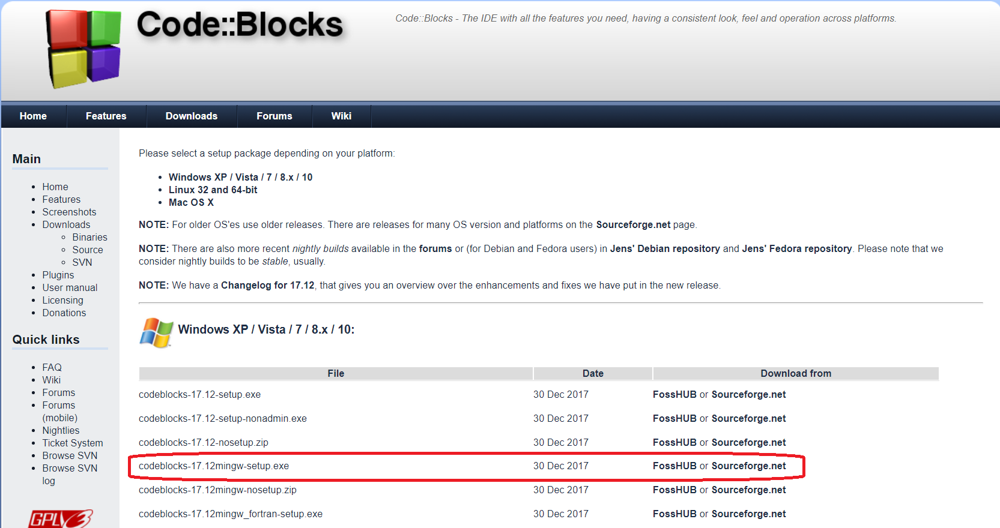

# Object Oriented Programming in C++
Notes, scripts and excercises created during my studies at University of Wroclaw in winter 2014/2015

## Table of contents
* [General info](#general-info)
* [Screenshots](#screenshots)
* [Programming language](#programming-language-and-enviroment)
* [Status](#status)

## General info
Classes are conducted for maths students at UWr.
The main goal of the course is to continue teaching of basics of programming in C++.
Classes were conducted by Dr. Łukasz Wojakowski.

## Screenshots

## Programming language and enviroment
* C++ Programming Language
* Code::Blocks

## Features
List of features ready and TODOs for future development
* Solutions for some excercises

To-do list:
* Solutions for all excercises
* Create comprehensive notes

## Status
Project is: _finished_
